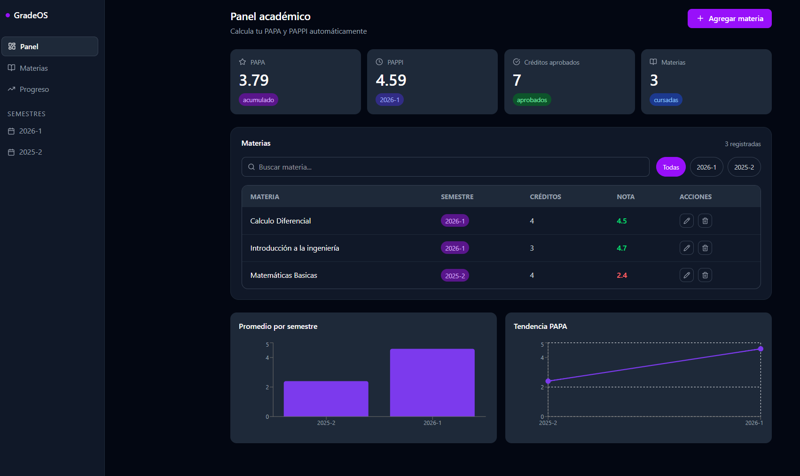

<div align="center">


<br />
<br />

# GradeOS

### Calculadora de PAPA y PAPPI universitario — Universidad Nacional de Colombia

**GradeOS** es una aplicación web moderna para calcular y visualizar tu promedio académico (PAPA) y el promedio del semestre más reciente (PAPPI), con persistencia de datos, gráficas de rendimiento y una interfaz tipo dashboard profesional.

<br />

🌐 **[Ver aplicación en vivo →](https://grade-os-gamma.vercel.app)**

<br />

</div>

---

## Funcionalidades

- **Cálculo automático** de PAPA y PAPPI en tiempo real
- **Agregar, editar y eliminar** materias fácilmente
- **Filtros por semestre** y búsqueda por nombre
- **Persistencia automática** — tus datos se guardan en el navegador
- **Gráficas de rendimiento** por semestre y tendencia del PAPA
- **Modo oscuro** automático según tu sistema
- **Responsive** — funciona en celular y PC
- **Validaciones** — notas entre 0.0 y 5.0, créditos positivos, campos obligatorios
- **Materias futuras** — agrega materias sin nota y no afectan el cálculo

---

## Vista previa



---

## Lógica de cálculo

La lógica está basada en el sistema de promedios ponderados de la UNAL:

```
PAPA  = Σ(calificación × créditos) / Σ(créditos)   [todas las materias con nota]
PAPPI = PAPA del semestre más reciente
```

Las materias sin calificación son ignoradas en el cálculo, igual que en el sistema oficial.

---

## Tecnologías

| Tecnología | Uso |
|---|---|
| React 18 | Interfaz de usuario |
| Vite 8 | Bundler y servidor de desarrollo |
| TailwindCSS 4 | Estilos y diseño responsive |
| Framer Motion | Animaciones suaves |
| Recharts | Gráficas de rendimiento académico |
| Lucide React | Íconos modernos |
| localStorage | Persistencia de datos sin backend |
| Vercel | Deploy gratuito y automático |

---

## Cómo correrlo localmente

```bash
# 1. Clona el repositorio
git clone https://github.com/crdiazo/GradeOS.git
cd GradeOS

# 2. Instala las dependencias
npm install

# 3. Corre el servidor de desarrollo
npm run dev

# 4. Abre en tu navegador
http://localhost:5173
```

---

## Estructura del proyecto

```
GradeOS/
├── src/
│   ├── components/
│   │   ├── charts/
│   │   │   └── SemesterChart.jsx      (Gráficas de barras y tendencia)
│   │   ├── layout/
│   │   │   └── Sidebar.jsx            (Barra lateral con navegación)
│   │   ├── stats/
│   │   │   └── StatsCards.jsx         (Tarjetas de PAPA, PAPPI, créditos)
│   │   └── subjects/
│   │       ├── SubjectForm.jsx        (Modal para agregar/editar materias)
│   │       └── SubjectTable.jsx       (Tabla con búsqueda y filtros)
│   ├── hooks/
│   │   └── useSubjects.js             (Lógica central y localStorage)
│   ├── utils/
│   │   └── calculator.js              (Cálculo de PAPA y PAPPI)
│   └── App.jsx                        (Componente raíz)
├── public/
├── index.html
└── vite.config.js
```

---

## Roadmap

- [ ] Autenticación para guardar perfil en la nube
- [ ] Exportar datos a PDF o Excel
- [ ] Simulador de notas — "¿qué necesito para subir mi PAPA?"
- [ ] App móvil con React Native
- [ ] Soporte para múltiples carreras

---

## Autor

**Cristian Andrés Díaz Ortega** — crdiazo@unal.edu.co
[@crdiazo](https://github.com/crdiazo)

Universidad Nacional de Colombia

---

<div align="center">

Hecho con amor para estudiantes de la UNAL

⭐ Si te fue útil, dale una estrella al repositorio

</div>